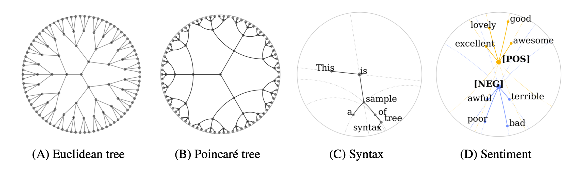

  

Boli Chen\*, Yao Fu\*, Guangwei Xu, Pengjun Xie, Chuanqi Tan, Mosha Chen, Liping Jing. _Probing BERT in Hyperbolic Spaces_. ICLR 2021. 

## Requirements

    $ pip install -r requirements.txt

## Sentiment Visualization with Pretrained Probes

Probe checkpoints are in the folder `./SentimentProbe/checkpoint`.

Use the Jupyter Notebook `Sentiment-Visualization-Poincare/Euclidean.ipynb`.

Play with it by changing the input text.

### Example

  

_BERT is a good model_

## Syntax Visualization with Pretrained Probes

Use the Jupyter Notebook `SyntaxProbe/Syntax-Visualization-Poincare/Euclidean.ipynb`.

## Key Implementation 
Equation (1), the poincare distance is implemented within the [geoopt](https://github.com/geoopt/geoopt) library, `Stereographic` class. In our work we just call its implementation. 

Our Poincare probe is implemented in `SyntaxProbe/probe/hyper.py`, `PoincareProbe` class and `SentimentProbe/probe/probe.py`, `PoincareProbe` class. 

Equation (2) and (3) in the paper correspond to:
* `SyntaxProbe/probe/hyper.py` line 80 to 82 for syntax
* `SentimentProbe/probe/probe.py` line 60 - 62 for sentiment

Equation (4) and (5) in the paper correspond to `SyntaxProbe/probe/hyper.py`, `PoincareProbeBase` class, function `distance` (line 16 - 34) and `depth` (line 36 - 50). 

Equation (6) in the paper correspond to `SentimentProbe/probe/probe.py` line 63 - 64. 

Optimization:
* For the syntax probe, there is no parameters lay in the hyperbolic space (we project embeddings into the hyperbolic space, but the parameters for the projections are themselves in euclidean). So we use normal Adam optimizer.
* For the sentiment probe, the two meta embeddings are in the hyperbolic space (`SentimentProbe/probe/probe.py` line 51 - 52) while the rest are in the euclidean space. So we use `RiemannianAdam` for the meta embeddings in ``SentimentProbe/run.py` line 91-92. Note that this optimizer will different the space of the parameters and [operate accordingly](https://github.com/geoopt/geoopt/blob/master/geoopt/optim/radam.py). 

## Reproduction

You will need access to the PTB dataset from [LDC](https://catalog.ldc.upenn.edu/LDC99T42).
Then use the [scripts from Hewitt](https://github.com/john-hewitt/structural-probes/tree/master/scripts) to preprocess the data. You only need the `convert_splits_to_depparse.sh` and `convert_conll_to_raw.py` file since we will use our own in `SyntaxProbe/data.py` to get BERT embeddings from the current huggingface transformers library (current = 2021.03.19). 

You will need to name the datasets and create folders accordingly, checkout `SyntaxProbe/data.py` for the directory names. 

Then use `run.py`, which can be found in the sub-folders `./SyntaxProbe` and `./SentimentProbe`. This would enable you to reproduce Table 1 and Table 2, which are our major results. 

We do not use fixed random seeds. Generally we do not recommend using any fixed seeds. We recommend doing multiple runs for training and observe the mean and variance of the performance. 
